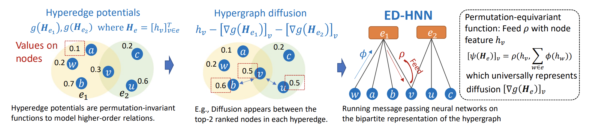

# Equivariant Hypergraph Diffusion Neural Operators

[](https://opensource.org/licenses/MIT)

The official implementation of ICLR 2023 paper [Equivariant Hypergraph Diffusion Neural Operators](https://arxiv.org/abs/2207.06680).

Peihao Wang, Shenghao Yang, Yunyu Liu, Zhangyang (Atlas) Wang, Pan Li

## Introduction

In this work, we are inspired by hypergraph diffusion algorithms and design a novel HNN architecture that holds provable expressiveness while keeping efficiency. 
Abstract: Hypergraph neural networks (HNNs) using neural networks to encode hypergraphs provide a promising way to model higher-order relations in data and further solve relevant prediction tasks. However, higher-order relations often contain complex patterns and are hard to process due to their irregularity. Hence, designing an HNN that suffices to express these relations while keeping computational efficiency is challenging. This work proposes a novel HNN architecture named ED-HNN. Inspired by recent hypergraph diffusion algorithms, ED-HNN provably represents any continuous equivariant hypergraph diffusion operators which are known capable of modeling complex higher-order relations. Besides being expressive, ED-HNN can be implemented efficiently by combining the star expansions of hypergraphs with standard message passing neural networks. ED-HNN also shows great superiority in processing heterophilic hypergraphs and constructing deep models. We evaluate ED-HNN over nine real-world hypergraph datasets. ED-HNN achieves uniformly state-of-the-art performance over these nine datasets and outperforms the previous best baselines by more than 2% over four datasets therein.



## Getting Started

### Dependency

To run our code, the following Python libraries which are required to run our code:

```
pytorch 1.8.0+
torch-geometric
torch-scatter
torch-sparse
torch-cluster
```

### Data Preparation

Download our preprocessed dataset from the [HuggingFace Hub](https://huggingface.co/datasets/peihaowang/edgnn-hypergraph-dataset).
Then put the downloaded directory under the root folder of this repository. The directory structure should look like:
```
ED-HNN/
  <source code files>
  ...
  raw_data
    20newsW100
    coauthorship
    cocitation
    ...
```

## Training

To train ED-HNN, please use the command below.
```
python train.py --method EDGNN --dname <dataset name> --All_num_layers <total number of layers> --MLP_num_layers <MLP depth> --MLP_hidden <MLP dimension>
--Classifier_num_layers <classifier depth> --Classifier_hidden <classifier dimension>
--lr <learning rate> --wd <weight_decay>
--epochs <num epochs> --cuda <cuda id>
--data_dir <data_path> --raw_data_dir <raw_data_path>
```
where `--MLP_num_layers` and `--MLP_hidden` specify the hyper-parameters for internal MLPs. One can also specify `--MLP2_num_layers` and `--MLP3_num_layers` for different internal MLPs separately. `--Classifier_num_layers` and `--Classifier_hidden` defines the hyper-parameters for the classifier.

Note that `--raw_data_dir` is the full path to load raw data. It is often `./raw_data/<dataset_name>` For `cocitation` or `coauthorship` datasets, the corresponding data folders are under `./raw_data/cocitation` and `./raw_data/coauthorship` respectively. The processed data will be saved into the path specified by `--data_dir`. It is recommended to use path name like `./data/<dataset_name>`.

Please use the following commands to reproduce our results:

<details>

<summary>Cora</summary>

```
python train.py --method EDGNN --dname cora --All_num_layers 1 --MLP_num_layers 0 --MLP2_num_layers 0 
--MLP3_num_layers 1 --Classifier_num_layers 1 --MLP_hidden 256 --Classifier_hidden 256 --aggregate mean
--restart_alpha 0.0 --lr 0.001 --wd 0 --epochs 500 --runs 10
--cuda <cuda_id> --data_dir <data_path> --raw_data_dir <raw_data_path> 
```

</details>

<details>

<summary>Citeseer</summary>

```
python train.py --method EDGNN --dname citeseer --All_num_layers 1 --MLP_num_layers 0 --MLP2_num_layers 0
--MLP3_num_layers 1 --Classifier_num_layers 1 --MLP_hidden 256 --Classifier_hidden 256 --aggregate mean 
--restart_alpha 0.0 --lr 0.001 --wd 0 --epochs 500 --runs 10
--cuda <cuda_id> --data_dir <data_path> --raw_data_dir <raw_data_path>
```

</details>


<details>

<summary>Pubmed</summary>

```
python train.py --method EDGNN --dname pubmed --All_num_layers 8 --MLP_num_layers 2 --MLP2_num_layers 2
--MLP3_num_layers 2 --Classifier_num_layers 2 --MLP_hidden 512 --Classifier_hidden 256 --normalization None --aggregate mean
--restart_alpha 0.5 --lr 0.001 --wd 0 --epochs 500 --runs 10
--cuda <cuda_id> --data_dir <data_path> --raw_data_dir <raw_data_path>
```

</details>


<details>

<summary>Cora-CA</summary>

```
python train.py --method EDGNN --dname coauthor_cora --All_num_layers 1 --MLP_num_layers 0 --MLP2_num_layers 0
--MLP3_num_layers 1 --Classifier_num_layers 2 --MLP_hidden 128 --Classifier_hidden 96 --aggregate mean 
--restart_alpha 0.0 --lr 0.001 --wd 0 --epochs 500 --runs 10
--cuda <cuda_id> --data_dir <data_path> --raw_data_dir <raw_data_path>
```

</details>

<details>

<summary>DBLP-CA</summary>

```
python train.py --method EDGNN --dname coauthor_dblp --All_num_layers 1 --MLP_num_layers 0 --MLP2_num_layers 0
--MLP3_num_layers 1 --Classifier_num_layers 2 --MLP_hidden 128 --Classifier_hidden 96 --aggregate mean
--restart_alpha 0.0 --lr 0.001 --wd 0 --epochs 500 --runs 10
--cuda <cuda_id> --data_dir <data_path> --raw_data_dir <raw_data_path>
```

</details>


<details>

<summary>Senate Committees</summary>

```
python train.py --method EDGNN --dname senate-committees-100 --All_num_layers 8 --MLP_num_layers 2 --MLP2_num_layers 2
--MLP3_num_layers 2 --Classifier_num_layers 2 --MLP_hidden 512 --Classifier_hidden 256 --aggregate mean 
--restart_alpha 0.5 --lr 0.001 --wd 0 --epochs 500 --runs 10 --feature_noise 1.0
--cuda <cuda_id> --data_dir <data_path> --raw_data_dir <raw_data_path>
```

</details>

<details>

<summary>House Committees</summary>

```
python train.py --method EDGNN --dname house-committees-100 --All_num_layers 8 --MLP_num_layers 2 --MLP2_num_layers 2
--MLP3_num_layers 2 --Classifier_num_layers 1 --MLP_hidden 256 --Classifier_hidden 128 --aggregate mean 
--restart_alpha 0.5 --lr 0.001 --wd 0 --epochs 500 --runs 10 --feature_noise 1.0
--cuda <cuda_id> --data_dir <data_path> --raw_data_dir <raw_data_path>
```

</details>

## Citation

This repository is build based on AllSet [official repository](https://github.com/jianhao2016/AllSet).
If you find this work or our code implementation helpful for your own resarch or work, please cite our paper.
```
@inproceedings{wang2022equivariant,
  title={Equivariant Hypergraph Diffusion Neural Operators},
  author={Wang, Peihao and Yang, Shenghao and Liu, Yunyu and Wang, Zhangyang and Li, Pan},
  booktitle={International Conference on Learning Representations (ICLR)},
  year={2023}
}
```
